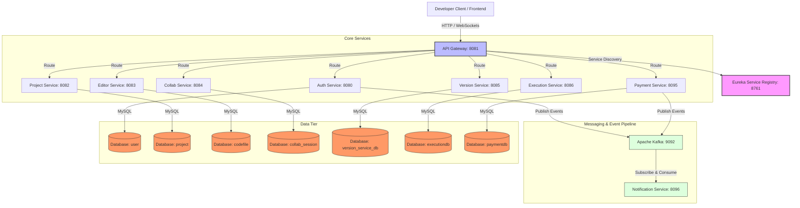

# 💻 CodeSync Backend

Welcome to the backend repository of **CodeSync** — a premium, high-performance, real-time collaborative coding platform built as a microservices architecture using Spring Boot, Spring Cloud, Apache Kafka, MySQL, and Docker.

CodeSync allows developers to collaborate in real-time, manage project directory trees, execute code inside a secure sandboxed environment, manage versions of their files, purchase subscription quotas, and receive event-driven notifications.

---

## 🏗️ System Architecture

CodeSync is designed around a decoupled, highly scalable event-driven microservices architecture. Here is a high-level overview of how the services interact:



---

## 📁 Microservices Directory

The backend consists of **10 distinct microservices**:

| # | Service Name | Port | Database (MySQL) | Core Responsibilities |
|---|--------------|------|------------------|-----------------------|
| 1 | **Service Registry** | `8761` | *None* | Service discovery (Netflix Eureka) for dynamic routing. |
| 2 | **API Gateway** | `8081` | *None* | Unified entry point, request routing, rate limiting, and centralized Swagger UI. |
| 3 | **Auth Service** | `8080` | `user` | JWT-based auth, Google/GitHub OAuth2, roles (`DEVELOPER`, `ADMIN`), profile management. |
| 4 | **Project Service** | `8082` | `project` | Management of workspaces, repositories, directory structure (files and folders). |
| 5 | **Editor Service** | `8083` | `codefile` | File content management, opening/editing, and workspace session orchestration. |
| 6 | **Collab Service** | `8084` | `collab_session` | WebSockets-based real-time room creation and collaborative editing coordination. |
| 7 | **Version Service** | `8085` | `version_service_db` | Commit logs, file history, rollbacks, and file version control. |
| 8 | **Execution Service** | `8086` | `executiondb` | Safe, sandboxed code compilation and execution using Docker. |
| 9 | **Payment Service** | `8095` | `paymentdb` | PayPal/Stripe integrations, token purchase ledger, and execution quota updates. |
| 10 | **Notification Service** | `8096` | *None* | Consumes events from Kafka and sends emails (SMTP) for registrations, approvals, and payments. |

---

## 🛠️ Tech Stack & Infrastructure

- **Languages:** Java 21
- **Frameworks:** Spring Boot 4.x, Spring Cloud (Gateway, Eureka)
- **Database:** MySQL 8.x
- **Event Messaging:** Apache Kafka 3.x
- **Build Tool:** Apache Maven 3.9+
- **Security:** Spring Security + JWT + OAuth2 Client
- **Testing & Quality:** JUnit 5, Mockito, JaCoCo (Coverage threshold >80%), SonarQube

---

## 🚀 Setup & Execution

### 1. Prerequisites
Ensure you have the following installed on your machine:
- **Java Development Kit (JDK 21)** (A script `setup-jdk.ps1` is provided to download/extract it locally if needed).
- **Maven** (3.9+)
- **MySQL Server**
- **Docker & Docker Compose** (for running Apache Kafka, Zookeeper, and execution sandbox)

### 2. Database Initialization
Create the following databases in your MySQL server:
```sql
CREATE DATABASE user;
CREATE DATABASE project;
CREATE DATABASE codefile;
CREATE DATABASE collab_session;
CREATE DATABASE version_service_db;
CREATE DATABASE executiondb;
CREATE DATABASE paymentdb;
```
Configure your MySQL credentials in each service's `src/main/resources/application.properties` or set them via environment variables.

### 3. Running Kafka Infrastructure
Start Kafka and Zookeeper:
```bash
docker-compose up -d
```

### 4. Running Microservices
Services should be started in the following logical sequence:
1. **Service Registry** (`serviceregistry`) — Wait until the dashboard is accessible at `http://localhost:8761`.
2. **API Gateway** (`api-gateway`)
3. **Auth Service** (`auth-service`)
4. **All other functional services** (Project, Editor, Collab, Version, Execution, Payment, Notification)

To run a service locally:
```bash
mvn spring-boot:run -pl <service-folder-name>
```

### 5. Running Code Quality Analysis (SonarQube)
To compile, run test suites with code coverage reporting, and push metrics to SonarQube:
```bash
# Run tests and verify JaCoCo reports
mvn clean verify

# Start SonarQube analysis
./sonar-run.bat
```

---

## 🔒 Security Flow

### JWT Authentication
1. User logs in via the API Gateway to Auth Service: `POST /auth/login`.
2. Auth Service validates credentials and returns a secure JWT.
3. Client attaches the JWT to subsequent requests:
   ```http
   Authorization: Bearer <token>
   ```
4. API Gateway validates the JWT before routing to downstream protected resources.

### OAuth2 Integration
CodeSync supports social login using Google and GitHub. The Auth Service handles callback redirection, user account provisioning (if registering for the first time), and issues platform-compatible JWT tokens.

---

## 📧 Event-Driven Architecture (Kafka)
We use Apache Kafka to decouple long-running operations. For instance:
* **User Registered:** Auth Service publishes a `user-created` event.
* **Token Purchase Completed:** Payment Service publishes a `payment-success` event.
* **Email Dispatch:** Notification Service consumes these events and sends HTML-formatted emails to developers via SMTP.